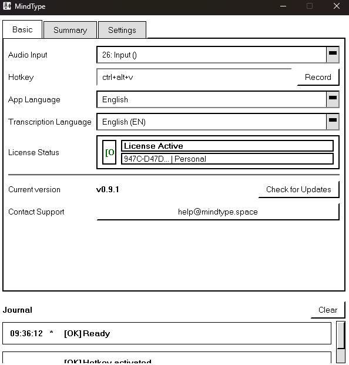

<div align="center">

# MindType

**Voice-to-text with cloud or local processing — you choose the data route.**



Additional screenshots:
- [Main Window (Alt)](docs/assets/screenshot_app.png)
- [Main Window (Second View)](docs/assets/screenshot_app2.png)
- [Error State](docs/assets/screenshot_error.png)

[](LICENSE)
[]()
[]()
[]()

[Download](#installation) • [Features](#features) • [Usage](#usage) • [Building](#building-from-source)

</div>

---

## Features

| Feature | Description |
|---------|-------------|
| **Voice Transcription** | Speak naturally, get accurate text. Supports 100+ languages. |
| **AI Summaries** | Auto-generate meeting notes, study guides, lecture summaries. Supports multiple LLM providers. |
| **File Processing** | Transcribe audio/video files (MP3, WAV, MP4, MKV, etc). |
| **Hybrid processing** | Use OpenRouter or other cloud providers on a laptop, or install local models for offline work. |
| **Export Options** | Save transcripts and summaries as PDF or HTML. |
| **Fast** | Powered by Whisper with GPU acceleration support. |

## Installation

### Windows (Beta)

1. Download the latest installer from the official website: [mindtype.space](https://mindtype.space)
2. Run `MindType-Setup.exe`
3. Launch MindType from the Start Menu

### Linux (Coming Soon)

Coming soon.

### macOS (Coming Soon)

Coming soon.

## Usage

### Voice Input

1. Press `Ctrl+Alt+V` (customizable) to start recording
2. Speak naturally
3. Press the hotkey again to stop and transcribe

### File Processing

1. Go to the Summary tab
2. Drag and drop audio/video files
3. Click "Process" to transcribe and summarize

### AI Summaries

MindType can automatically generate structured summaries from your transcriptions:
- Meeting notes with action items
- Study notes from lectures
- Key points from podcasts/videos

**Supported LLM Providers:**
- **OpenAI** (GPT-4, GPT-4o, etc.)
- **Anthropic** (Claude 3.5, Claude 3)
- **Google Gemini** (Gemini Pro, Gemini Flash)
- **Ollama** (local models - Llama, Mistral, etc.)
- **OpenRouter** (access to 100+ models)

For most laptops, cloud summarization is the recommended route: it avoids
downloading and running a large local LLM. Local Ollama remains an explicit
offline option for users whose hardware and privacy requirements justify it.

### Data routes and privacy

MindType does not claim that every workflow is offline. The route depends on
the options selected by the user:

- local Whisper/whisper.cpp keeps transcription audio on the computer;
- OpenRouter transcription sends audio to OpenRouter and its selected upstream
  provider;
- MindType Cloud or another cloud LLM receives the transcript when selected for
  summarization;
- Ollama keeps summarization local;
- crash reports are saved locally and are sent only after the user checks the
  send option in the crash dialog.

Cloud providers have their own retention and processing terms. OpenRouter
requests made by MindType ask providers not to retain inputs for training via
`provider.data_collection = deny`, but this is not a substitute for reviewing
the provider's current policy. A fully local route requires both a local
transcription backend and Ollama, and may be slow or inaccurate on a typical
laptop.

## Building from Source

### Requirements

- Python 3.10+
- pip

### Setup

```bash
# Clone the repository
git clone https://github.com/Maxborland/mindtype-app.git
cd mindtype-app

# Create virtual environment
python -m venv venv
source venv/bin/activate  # Linux/macOS
.\venv\Scripts\activate   # Windows

# Install dependencies
pip install -r requirements.txt

# Run
python main.py
```

### Building Installers

**Windows:**
```powershell
.\build_windows.ps1
```

**Linux:**
```bash
./build_linux.sh
```

**macOS:**
```bash
./build_macos.sh
```

## Pro Version

MindType offers a 7-day free trial. Desktop licensing and usage-based cloud
processing are separate cost categories; current commercial terms are shown on
the official website.

**[Get Pro License](https://mindtype.space)**

## Contributing

Contributions are welcome! See [CONTRIBUTING.md](CONTRIBUTING.md) for guidelines.

## License

This project is licensed under the AGPL-3.0 License - see the [LICENSE](LICENSE) file for details.

If you use MindType in a commercial product, you must open-source your modifications under the same license.

---

<div align="center">

**[Download](https://mindtype.space)** • **[Website](https://mindtype.space)** • **[Report Bug](../../issues)**

</div>
